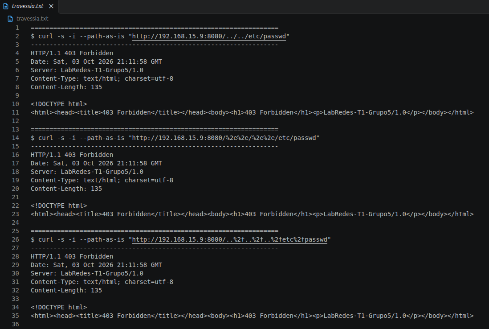
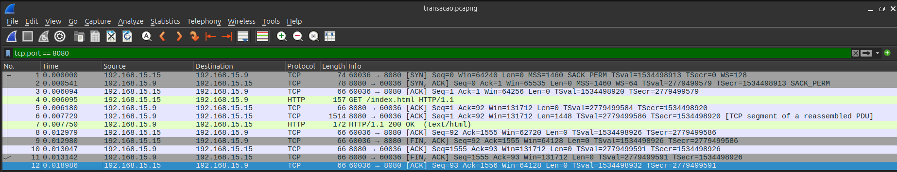
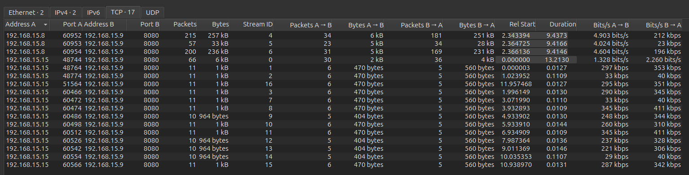

# 1. Arquitetura

**Ambiente.** Servidor: notebook macOS (`192.168.15.9`). Clientes: notebook Ubuntu
(`192.168.15.15`) e iPhone (`192.168.15.8`), na mesma Wi-Fi doméstica, em IPv4. O servidor
escuta em `0.0.0.0:8080` com raiz `./www`.

**Estrutura.** Um único arquivo, `server.py`, em Python 3, só com a biblioteca padrão:

| Função | Responsabilidade |
|---|---|
| `main` | `socket` → `bind` → `listen` → laço de `accept`; uma thread por conexão |
| `handle_connection` | acumula os `recv()` num buffer até `\r\n\r\n`; o que sobra fica para a próxima requisição; descarta o corpo (`Content-Length`) |
| `parse_request` | request line com 3 partes e versão `HTTP/1.0` ou `HTTP/1.1`; cabeçalhos `nome: valor` |
| `resolve_path` | decodifica `%XX` e verifica com `realpath` + `commonpath` se o caminho está dentro do root |
| `send_file`, `send_error` | status e cabeçalhos obrigatórios; corpo em blocos de 64 KB; HEAD sem corpo |

**Concorrência: uma thread por conexão.** Cada conexão é atendida de forma sequencial
(recv → parse → send) na sua própria thread, então uma conexão lenta bloqueia só a sua
thread. O timeout ocioso de 5 s é um `settimeout` no socket da conexão. Para a escala do
trabalho, isso é mais simples que I/O não bloqueante (`selectors`), que exigiria uma
máquina de estados por conexão. O GIL não pesa, porque as threads passam quase todo o
tempo bloqueadas em I/O.

**Decisões.** Depois de um 400 a conexão é fechada, porque não dá para saber onde começa a
próxima requisição. O cabeçalho e o primeiro bloco do corpo saem num único `sendall`: com
dois `send()` pequenos seguidos, o Nagle seguraria o segundo até chegar o ACK atrasado do
cliente.

# 2. Tabela de conformidade

Requisições feitas do Ubuntu (`scripts/conformidade.sh`). Toda resposta traz `Date`
(IMF-fixdate), `Server: LabRedes-T1-Grupo5/1.0`, `Content-Type` e `Content-Length`.

| Status | Requisição `curl` | Resposta |
|---|---|---|
| 200 | `curl -i http://192.168.15.9:8080/index.html` | `200 OK`, `Content-Length: 1404` + corpo |
| 200 (HEAD) | `curl -I http://192.168.15.9:8080/index.html` | `200 OK`, `Content-Length: 1404`, sem corpo |
| 400 | `curl -i --request-target "/index.html extra" http://192.168.15.9:8080/` | `400 Bad Request` (request line inválida), `Connection: close` |
| 400 | `curl -i -H $'X-Ok: 1\r\nCabecalhoSemDoisPontos' http://192.168.15.9:8080/` | `400 Bad Request` (cabeçalho sem `:`), `Connection: close` |
| 403 | `curl -i --path-as-is http://192.168.15.9:8080/../../etc/passwd` | `403 Forbidden` |
| 404 | `curl -i http://192.168.15.9:8080/nao-existe.html` | `404 Not Found` |
| 405 | `curl -i -X POST -d "a=1" http://192.168.15.9:8080/index.html` | `405 Method Not Allowed`, `Allow: GET, HEAD` |

# 3. Demonstração de segurança

Todas as tentativas de travessia retornaram **403 Forbidden** (`scripts/travessia.sh`,
com `--path-as-is` para o `curl` não normalizar o caminho):

| Requisição | Técnica |
|---|---|
| `GET /../../etc/passwd` | `..` literal |
| `GET /%2e%2e/%2e%2e/etc/passwd` | `.` em percent-encoding |
| `GET /..%2f..%2f..%2fetc%2fpasswd` | `/` em percent-encoding |
| `GET /img/../../../etc/passwd` | sai do root a partir de um subdiretório |

O caminho é decodificado **antes** da verificação e comparado na forma canônica
(`realpath` resolve `..` e links simbólicos) com `commonpath`, que compara diretórios
inteiros (`/www2` não passa por `/www`).



# 4. Captura de uma transação completa

`curl http://192.168.15.9:8080/index.html` feito do Ubuntu, capturado no Mac
(`capturas/transacao.pcapng`):



| Pacotes | Papel |
|---|---|
| 1–3 | **Handshake**: SYN, SYN-ACK, ACK (5,5 ms do SYN-ACK ao ACK = 1 RTT) |
| 4 | **Requisição**: `GET /index.html HTTP/1.1` (91 B) |
| 5–8 | **Resposta**: `200 OK` em 2 segmentos (1448 B + 106 B) e os ACKs |
| 9–12 | **Encerramento**: FIN do cliente, ACK, FIN do servidor, ACK |

# 5. Evidência de atendimento simultâneo

O Ubuntu abriu uma requisição **lenta** (`scripts/simultaneo.sh`, uma linha de cabeçalho
por segundo durante 15 s). Enquanto ela estava pendente, o servidor atendeu requisições
rápidas do próprio Ubuntu e a página inteira no navegador do iPhone, cada conexão na sua
thread (`capturas/servidor.log`):

```
18:19:50.881 [conn 26 | t26] conexão aberta de 192.168.15.15:48744   <- lenta
18:19:55.303 [conn 32 | t32] conexão aberta de 192.168.15.8:60952    <- iPhone
18:19:55.303 [conn 32 | t32] "GET / HTTP/1.1" 200 1404B
18:19:55.324 [conn 33 | t33] "GET /img/logo.png HTTP/1.1" 200 18561B
18:20:06.063 [conn 26 | t26] "GET /index.html HTTP/1.1" 200 1404B    <- lenta termina
```



# 6. RTT medido

Ping do Ubuntu ao Mac (`scripts/rtt.sh`: 50 pacotes a cada 0,2 s), antes de cada rodada:

| Rodada | Mínimo | Mediana | Média | Máximo |
|---|---|---|---|---|
| 1 | 5,32 ms | **7,09 ms** | 17,77 ms | 203,0 ms |
| 2 | 5,50 ms | **6,72 ms** | 15,73 ms | 89,8 ms |
| 3 | 4,50 ms | **7,04 ms** | 14,06 ms | 90,4 ms |

Usamos a mediana, porque picos do Wi-Fi puxam a média para cima. Nas capturas, o RTT dos
handshakes (do SYN-ACK ao ACK) tem mediana de **5,2 ms**. Ele é menor que o do ping
porque, com tráfego contínuo, o Wi-Fi não entra em economia de energia entre os pacotes.
Por isso a análise usa 5,2 ms.

# 7. Comparação C1 × C2

10 requisições a `/medicao.html` (4 636 B), cada cenário num único processo `curl`. Em
C1, com `Connection: close`, há uma conexão nova por requisição; em C2, uma conexão
persistente. A tabela mostra a rodada mediana de 3 (`capturas/c1.pcapng` e `c2.pcapng`).

| Métrica | C1 | C2 | Economia de C2 |
|---|---|---|---|
| Handshakes TCP completos | 10 | 1 | 9 |
| Pacotes | 152 | 78 | **48,7 %** |
| Bytes | 59 402 | 53 958 | **9,2 %** |
| Tempo total | 136,1 ms | 65,3 ms | **52,0 %** |

# 8. Overhead de conexão (C1)

Abrir uma conexão custa 3 pacotes (SYN 74 B + SYN-ACK 78 B + ACK 66 B = 218 B), e fechar
custa 4 pacotes (FIN, ACK, FIN, ACK, 66 B cada = 264 B). Cada conexão custa então
**7 pacotes e 482 B**. Em C1, as 10 conexões gastam **70 pacotes (46 % do total) e
4 820 B (8 %)** só em abrir e fechar. A diferença entre C1 e C2 se explica assim:

| Origem | Pacotes | Bytes |
|---|---|---|
| 9 conexões a mais × 7 pacotes | 63 | 4 338 |
| `Connection: close` na requisição e na resposta (10 × 2 × 19 B) | 0 | 380 |
| ACKs extras do cliente em conexões novas | 11 | 726 |
| **C1 − C2** | **74** | **5 444** |

A economia é grande em pacotes e pequena em bytes porque os pacotes de controle são
pequenos, enquanto os ~49 KB de conteúdo são os mesmos nos dois cenários.

# 9. Análise em função do RTT

Soma dos trechos de tempo na captura do servidor (rodada 1):

| Trecho | C1 | C2 | C1 − C2 |
|---|---|---|---|
| Handshakes (SYN → GET) | 63,5 ms (10×) | 6,4 ms (1×) | **+57,1 ms** |
| Servidor (GET → fim da resposta) | 8,8 ms | 6,8 ms | +2,0 ms |
| Cliente entre requisições | 59,3 ms | 41,4 ms | +17,9 ms |
| Encerramento final | 4,5 ms | 10,7 ms | −6,2 ms |
| **Total** | **136,1 ms** | **65,3 ms** | **+70,8 ms** |

Em C2 cada requisição custa cerca de **1 RTT** (resposta vai, próximo GET volta). Em C1,
custa cerca de **2 RTT**: antes do GET, o cliente precisa completar o handshake
(SYN → SYN-ACK → ACK). Os **9 handshakes a mais custam 57,1 ms ≈ 9 × 6,3 ms**, ou seja,
1 RTT por conexão nova, e respondem por 81 % da diferença. O restante (≈ 13,7 ms) é custo
fixo de trocar de conexão no cliente e no servidor e não depende da rede. No total,
70,8 / 5,2 ≈ **13,6 RTT**: 9 RTT de handshake mais esse custo fixo.

# 10. Conclusão

O custo extra de abrir uma conexão por requisição é aproximadamente
**(nº de conexões novas) × (1 RTT + custo fixo)**. Com RTT de 5 ms, o termo do RTT já é
81 % da diferença medida. A conexão persistente ganharia ainda mais:

- **com RTT maior**: com 100 ms (outro continente, rede móvel ou satélite), os mesmos
  9 handshakes custariam ~900 ms em vez de 57 ms;
- **com mais requisições por página**: cada recurso pequeno pagaria um handshake;
- **com HTTPS**: cada conexão nova também paga o handshake TLS (+1 a 2 RTT).

Em localhost (RTT ≈ 0) a diferença quase desaparece, e por isso a medição exige máquinas
distintas.
